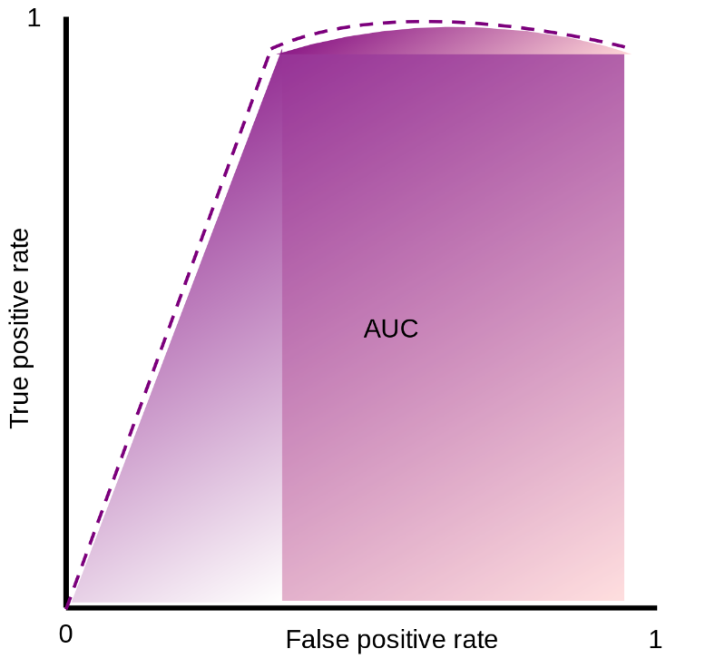
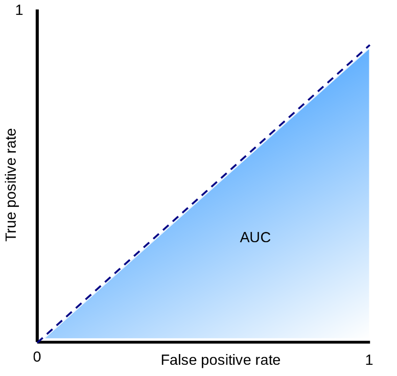
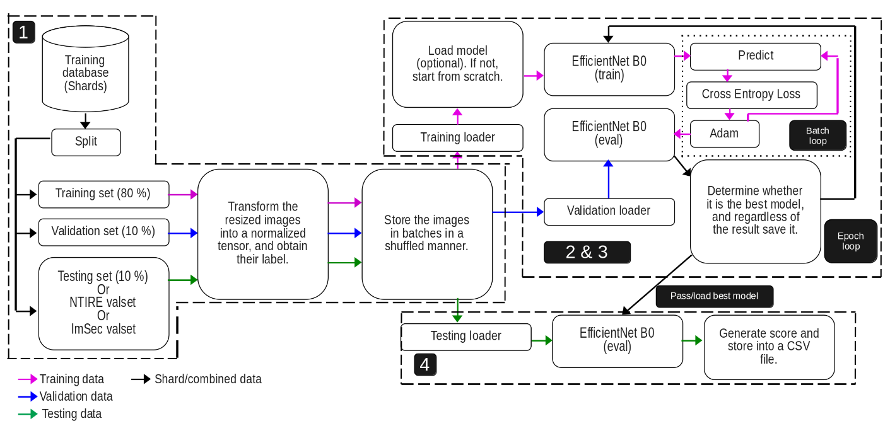
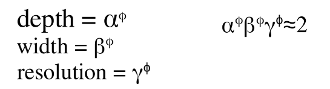

# Robust AI-Generated Image Detection algorithm for NTIRE 2026.

_As part of the course's project of Image Security Spring 2026 at EURECOM by [professor Jean-Luc Dugelay](https://dugelay.eurecom.io/)_

A modified image can be a very useful tool to deceive massive people with fake evidence & news to gain money and damage reputation. Once a friend of mine was selling his XBOX one and posting about it in his social media. One guy that was interested got in touch through messages with my friend, after my friend asked for a ticket deposit to then send his XBOX via delivery. The guy sent a modified picture of the ticket, my friend relied on him and sent the console. He was scammed. I know very risky way to sell a product, but this story was written to let you know that this can happen.

It is sometimes easy to detect a fake image because its modifications are perceptible from the human vision. However, with the recent creation of more powerful techniques, this detection is not quite noticeable many times, even machines can fail in detecting them. Therefore, this is a relevant issue.

One competition that is about distinguish real and fake images is the [NTIRE 2026](https://www.codabench.org/competitions/12761/). In short words, our algorithm has to be robust enough to detect real and AI-generated images, but these fake images are transformed after being created (in-the-wild) to add more difficulty to the challenge.

To assess the accuracy of the algorithms ROC(Receiver Operating Characteristic)-AUC(Area Under the Curve) was utilized. The graphical plot is composed of false positive rate and true positivy rate in x and y-axis repectively. An algorithm performs better when there is a significative higher true positive rate than false positive rate. Meaning that the curve should try to reach to the top of the vertical axis as soon as possible. It also can be seen as the higher is the AUC of that curve, the better is performing. The next graphical plot shows two scenarios when an algorithm its performance is outstanding (purple plot) and when it is not better than random guessing (blue plot).

__Proposed solution__

This type of challenge requires a powerful algorithm like a deep neural netwotk because it will be capable of finding statistical anomalies after a heavy training process. The general process of our proposed algorithm is illustrated in the next image.

Stage 1 - Data handling & format.

We were given two types of shards: training and validation (NTIRE valset). However, only the former one had included the labels (answer whether that image was real or fake). The latter was only used to generate a .csv with the guesses of our algorithm which will be assessed in the server. So no labels. That is why the training shard was split in training (80%), validation (10%), and training (10%) sets so we can also evaluate internally our algorithm and not be completely blind. The ImSec valset was the dataset from the course, it was utlized more for a getting started before going to NTIRE one. 

Then all the sets are transformed in the required format for the implemented Deep Learning algorithm, in this case EfficientNetB0 was selected (next stage explains more about it). Then the format should be images of size 224x224 pixels, then converting into tensors and normalizing them. After they were group in batches of 32 nomalized tensors per batch, this is to avoid consuming all the CPU resources when training.

Stage 2 - Training process.

Before explaining my architecture, EfficientNet B0 should be explained, so reader can understand how it works.

EfficientNet B0 was our model's backbone for learning. In fact, a pre-trained model with IMAGENET1K V1 dataset was utilized in order not to start from scratch "transfer learning". This dataset is made of 1,000 object classes and it has almost 1 million and a half of images for training, validating, and testing! How can the algorithm be able to detect fake images if it does not know about general objects? Well, this is the purpose of this dataset.

EfficientNet B0 is a Convolutional Neural Network (CNN) that adjusts the number of channels, layers, and resolution. Actually, it has to follow the next equations:

The researchers found the best values for alpha, beta, and gamma are 1.2, 1.1, & 1.15 respectively.
By multiplying all the three parameters should be approximately equal to two, this forces to increase the required resources by 2 whenever phi is increased by one.
Phi defines the architecture: how many channels, layers, and image resolution is supported. The higher phi is, the better the algorithm will be, but as tradeoff more resources are required. phi also determines the version of EfficientNet, for B0 the phi is 0, for B1 its phi is 1, and so on til B7. Therefore, in this case it means that everything is 1's.

What really means phi = 0? It is the baseline version, before any scaling is applied. Based on the [original paper](https://arxiv.org/pdf/1905.11946) in table 1, the architecture of EfficientNet B0 is made of up to 1280 channels, 18 Convolution (filters everything simultaneously) and Mobile inverted Bottleneck Convolution (MBConv; it separates convolutions) layers, and starts with an image of resolution of 224x224. For better versions (B1,B2,etc), the every parameter is increased.
 
The reasons EfficientNet B0 was chosen were that it is quite efficient compared against others from the original paper in figure 5 there is a comparison, as summary it needs fewer FLOPS to do even more that many other algorithms. Another motivation was that we can improve it by just changing phi, but the architecture family is the same.

Returning back to my architecture, both stages 2 & 3 are in the epoch loop. The training data are loaded in batches. Then in case an updated version model of our algorithm was saved, it can be loaded. The reason behind is because it trains with many Giga Bytes of dataset for each sharp, so to avoid losing our progress, the algorithm is saved after each epoch. It is also useful to select previous versions when symptoms of overfitting start to appear. After, the EfficientNet B0 model selected and it enters in the training loop where it predicts, Cross Entropy Loss calculates the error's penalty of the prediction, and then its weights & biases are rectified with Adaptive Moment Estimation (Adam) so next prediction can be more accurate. The learning rate is 0.0001; not too high to avoid bouncing when converging.

Stage 3 - Validation phase.

It is time to validate the model with our split labeled data, so we can know if it is performing better or there is no improvements. The correct predictions and the penalty values from the errors are accumulated to calculate the accuracy and the average loss value. If that loss value is lower then the lowest loss value recorded so far, then it will saved as bestModel.pth, otherwise it will saved but as currentModel.pth and not lowest loss value will be updated.

Stage 4 - Testing process. 

Once the algorithm was trained, it can be tested either with my split testing set 10% from the original training shard to know the results (non-blind way as it has labels), or use NTIRE or ImSec valset to generated the CSV and submit it into the platform (blind way as there is no lables) to know my results. There is no much to say about this stage.

Tentative improvements.

Use the 20% of validation and testing sets from original shard to train the algorithm. This because they contain valuable data for training (as it was supposed to be).It should be done at the very last step to avoid overfitting in our internal assessment.
Merge with another robust Deep Learning algorithm via ensemble learning in order to increase accuracy or increase the parameter phi.
