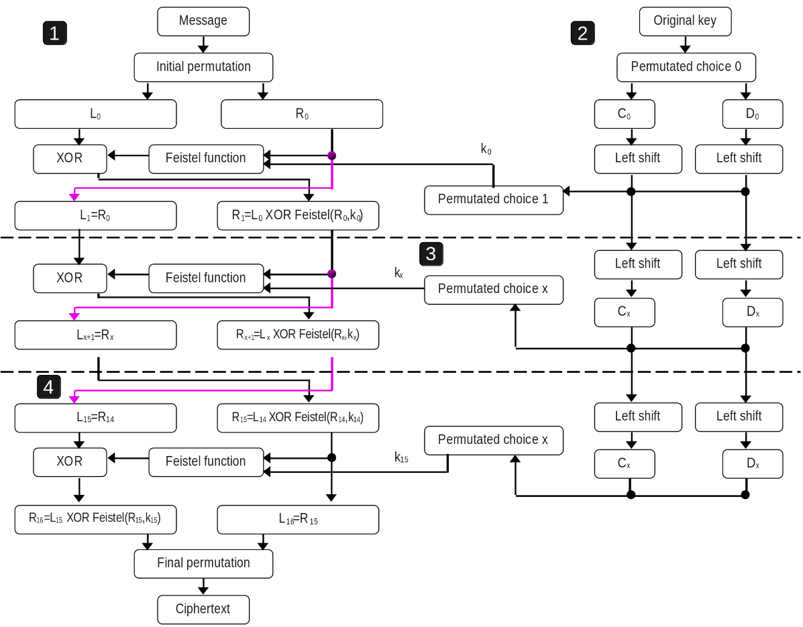
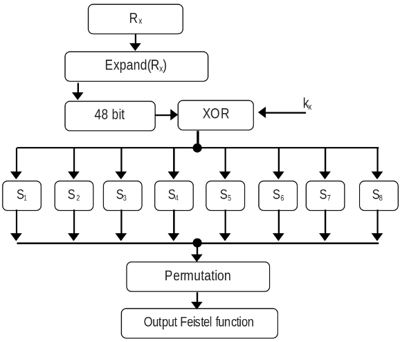

# Timing & Power Side Channel Analysis.

_As part of the course's laboratories of Hardware Security Spring 2026 at EURECOM by [professor Renaud Pacalet](https://perso.telecom-paristech.fr/pacalet/index_en.html)_

To assure confidentiality, many different types of cryptography algorithms exist. Their beauty is that instead of protecting the whole messages and the algorithms, only the keys must be protected and usually the keys' sizes are lower (by far) than the messages' sizes. It makes them feasible for implementing in the systems. However, the keys may be still leaked by analyzing the physical parameters and behavior of the cryptosystem. So, developers should consider the protection of those side channels. This article will explain how by analyzing the behavior of the time and power, keys can be extracted, but before going there, the DES (Data Encryption Standard) crypto algorithm will be explained as it is the victim in both scenarios.

## Brief explication of DES (the victim system).
This encryption algorithm used to be the standard some years ago because its key size (56 bits) is not enough now, as it can be guessed with a brute force attack in some days or even hours. However, this algorithm is useful to understand how key can be extracted with side channel analysis. The reason is its architecture by itself can provide a lot of information that makes this analysis even easier. Let's understand the some aspects of the [DES](https://csrc.nist.gov/files/pubs/fips/46/final/docs/nbs.fips.46.pdf) to be ready to carry out the analysis.

Inside DES, we can see as three subsystems. The first one is illustrated in the whole right side of the above image. That is named the key schedule whose purpose is to generate a key for each round with shift lefts and some permutation choice. The second one (left side from above image) is the architecture which is in charge of receiving the message and the keys for each round, and perform the encryption.
* The message is 64-bit size and initial permutation is applied, it only moves the position of the bit according to a pre-defined table in page 9 of the [DES FIPS paper](https://csrc.nist.gov/files/pubs/fips/46/final/docs/nbs.fips.46.pdf). Then the 32 bits Most Significant Bits (MSB) are moved to L0, and the rest (also 32 bits) to R0.
* The next value of L (L1) will be directly the value of R0.
* In order to calculate R1, Feistel function is applied to R0 and k0 (later will be explained this function in detail). And then, the result will be XORed with L0.

This 

## Explication of professor's API for carrying out these analysis.

## Side Channel Analysis with Timing against DES.

## Side Channel Analysis with Power against DES.

