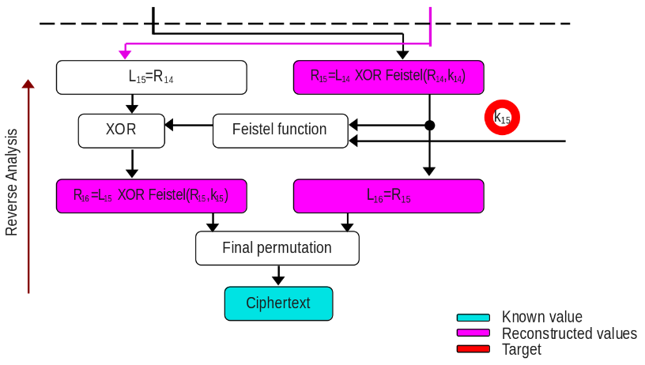

# Timing & Power Side Channel Analysis.

_As part of the course's laboratories of Hardware Security Spring 2026 at EURECOM by [professor Renaud Pacalet](https://perso.telecom-paristech.fr/pacalet/index_en.html)_

To assure confidentiality, many different types of cryptography algorithms exist. Their beauty is that instead of protecting the whole messages and the algorithms, only the keys must be protected and usually the keys' sizes are lower (by far) than the messages' sizes. It makes them feasible for implementing in the systems. However, the keys may be still leaked when there is a correlection between the physical parameters and behavior of the cryptosystem. So, developers should consider the protection of those side channels. This article will explain how by analyzing the behavior of the time and power, keys can be extracted, but before going there, the DES (Data Encryption Standard) crypto algorithm will be explained as it is the victim in both scenarios.

## Brief explication of DES (the victim system).
This encryption algorithm used to be the standard some years ago because its key size (56 bits) is not enough now, as it can be guessed with a brute force attack in some days or even hours. However, this algorithm is useful to understand how key can be extracted with side channel analysis. The reason is its architecture by itself can provide a lot of information that makes this analysis even easier. Let's understand the some aspects of the [DES](https://csrc.nist.gov/files/pubs/fips/46/final/docs/nbs.fips.46.pdf) to be ready to carry out the analysis.

Inside DES, we can see as three subsystems. The first one is illustrated in the whole right side of the above image. That is named the key schedule whose purpose is to generate a key for each round with shift lefts and some permutation choice. The second one (left side from above image) is the architecture which is in charge of receiving the message and the keys for each round, and perform the encryption.
* The message is 64-bit size and initial permutation is applied, it only moves the position of the bit according to a pre-defined table in page 9 of the [DES FIPS paper](https://csrc.nist.gov/files/pubs/fips/46/final/docs/nbs.fips.46.pdf). Then the 32 bits Most Significant Bits (MSB) are moved to L0, and the rest (also 32 bits) to R0.
* The next value of L (L1) will be directly the value of R0.
* In order to calculate R1, Feistel function is applied to R0 and k0 (later will be explained this function in detail). And then, the result will be XORed with L0.

These steps are repeated (except the Initial permutation) in each round, in total they are 16 rounds. In the last round (after performing the last feistel function and XOR, but before the inverse initial permutation), the L16 is now the right side of the pre-output ciphertext, and R16 is the left one. After, the inverse initial permutation is invoked and the ciphertext is the complete.

The third subsystem is the Feistel function and it is illustrated in the image above. The value of Rx from 32 bit is expanded to 48 bit (by duplicating some bits), then the subkey of that round (also 48 bits) is XORed with the expansion of Rx. The result from the XOR is separated by 6 bits per SBOX and the output will be of 4-bit size, so 32 bits when concatenated. The SBOX tables are fixed and only replaces the input value, this table is in page 12 of the DES FIPS paper.

## Explication of professor's API for carrying out these analyses.
The professor provided us his APIs:

* [DES in C](https://perso.telecom-paristech.fr/pacalet/HWSec/doc/ta/c/des_8h.html). All the required components to carry out the DES encryption & decryption are in that API, even there is a function that verifies the its correct implemetation with checksum of the outputs (plaintext, ciphertext, and secret keys). There are hamming weigth and distance functions, but they are useful for leaking the key (it will be explain later in this article).

* [Utils in C](https://perso.telecom-paristech.fr/pacalet/HWSec/doc/ta/c/utils_8h.html). Most of them are wrappers to allocate memory and open files. There are a couple of functions that prints error and warning.

* [PCC in C](https://perso.telecom-paristech.fr/pacalet/HWSec/doc/ta/c/pcc_8h.html). Pearson Correlations Coefficients that calculates how two variables move together in a line. When the value is near from +1 or -1 (the limits), it means that the correlation is strong. In contrast to when it is almost zero, means no correlation.

More provided resources: the messages with their respective ciphertext and trace (either time or power).

## Side Channel Analysis with Timing against DES.
The permutation function is vulnerable to timing attacks, it was created on purpose as part of the laboratory. Some condition statements were added, and this makes the timing trace changes based on permutation function's input.

In order to carry out the key extraction, we can analyze all the available data. So, we have the plaintext (not needed for now), ciphertext and time trace, the DES architecture with their fixed tables are public information. Based on this specific DES architecture nature, it is allowed to reconstruct the values from the previous round, consider the next image.

## Side Channel Analysis with Power against DES.

